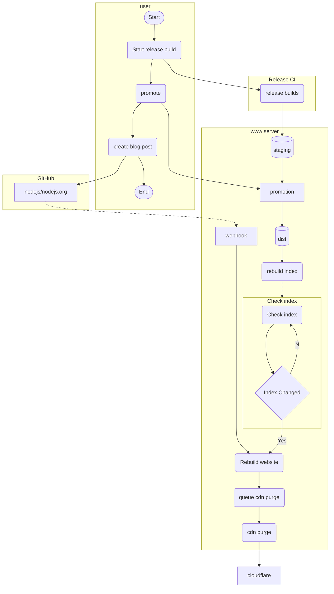

Experimenting with mermaid to document the flow for how nodejs.org currently works.

```mermaid
flowchart TD
    
    subgraph "user"
    start([Start])-->A(Start release build)--> promote(promote)-->blog(create blog post)-->F([End])
    end
    subgraph jenkins[Release CI]
    builds
    end
    subgraph github[GitHub]
    gh
    end
    subgraph www[www server]
    
      staging[(staging)] --> promotion -->dist[(dist)]
      dist-->rebuildIdx(rebuild index)
      
      subgraph chkIndex[Check index]
      checkIndex(Check index)-->idxChanged{Index Changed}
      idxChanged--No-->checkIndex
      
      end
      rebuildIdx-.->chkIndex
      webhook-->rebuild
      idxChanged--Yes-->rebuild(Rebuild website)
      rebuild-->cdnq(queue cdn purge)
      cdnq-->purge(cdn purge)
      
      end
    A-->builds(release builds)
    gh[nodejs/nodejs.org]-.->webhook
    promote-->promotion
    blog-->gh
    builds-->staging
    purge-->cloudflare

```

Reference image

